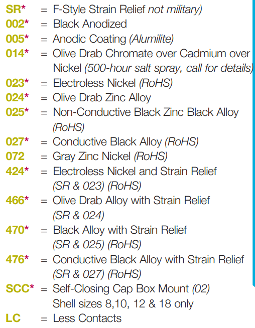

# Conector militar
En MS4M se usan 4 tipo de conectores para la control screen. los número de parte iniciales son los siguientes:

* **KPSE6E16-26PDN:** Usado para el cable arnes con pines machos
* **KPSE6E16-26SDN:** Usado para el cable arnes con pines hembra.
* **KPT7A16-26SEW:** Este es un conector hembra, se encuentra en la control screen.
* **KPT7A16-26PEW:** Este es un conector macho, se encuentra en la control screen.

## ¿Como seleccionar un conector militar para cable arnes?

Lo primero que de debe hacer es escoger el standar con el cual se va a trabajar, estos estandares tienen impacto en la calidad y precio del conector.

### MS3116, PT06, KPTSE06 y KPSE05A
Los conectores que comiencen por esta serie son usando para armar cable arnes.

{align=center}

El conector **KPSE05A** cuenta con menos tipo de backshell.

### Escoger el tipo de backshell

Este valro esta representado por una letra que tiene equivalencia con la siguiente imagen:

Entones para hacer un cable arnes, se podria escoger en pricipio

1. MS3116 **E**  
2. MS3116 **J**
3. MS3116 **P**
4. PT06 **A**
5. PT06 **E**
6. PT06 **A-(SR)**

### Escoger el Layout

Lo siguiente es escoger la cantidad de pines, en este caso siempre sera **16-26** este valor no puede cambiar.

Se puede ver la forma en la siguiente imagen.

Se podria, aumentar la especificacion entonces de la siguiente forma:

1. MS3116 **E** **16-26**
2. MS3116 **J** **16-26**
3. MS3116 **P** **16-26**
4. PT06 **A** **16-26**
5. PT06 **E** **16-26**
6. PT06 **A-(SR)** **16-26**

### Tipo de contactos

En este caso se escoge la **P** para conectores machos y **S** para conectores hembra.

El numero de parte quedaria de la siguiente forma:

| **Hembra**                 | **Macho**                  |
|------------------------|------------------------|
| MS3116 **E** **16-26** **S**  | MS3116 **E** **16-26** **P** |
| MS3116 **J** **16-26** **S**  | MS3116 **J** **16-26** **P** |
| MS3116 **P** **16-26** **S**  |  MS3116 **P** **16-26** **P**|
| PT06 **A** **16-26** **S**    | PT06 **A** **16-26** **P**|
| PT06 **E** **16-26** **S**    |PT06 **E** **16-26** **P**|
|PT06 **A-(SR)** **16-26** **S**|PT06 **A-(SR)** **16-26** **P**|

### Seleccionar rotacion

Los conectores que usadmos no cuentan con rotacion, por lo que ese valor se deja en blanco. una rotacion **W,X,Y o Z** no funciona en nuestro caso.

Entonces conociendo esto, la tabla anteror quedaria de la misma forma.

| **Hembra**                 | **Macho**                  |
|------------------------|------------------------|
| MS3116 **E16-26S**  | MS3116 **E16-26P** |
| MS3116 **J16-26S**  | MS3116 **J16-26P** |
| MS3116 **P16-26S**  |  MS3116 **P16-26P**|
| PT06 **A16-26S**    | PT06 **A16-26P**|
| PT06 **E16-26S**    |PT06 **E16-26P**|
|PT06 **A-(SR)16-26S**|PT06 **A-(SR)16-26P**|

### Modificador

Este ultimo parametro impacta en el acabado del conector, obteniendo asi los siguentes acabados.

### KPT7

* [Hoja de datos de conector militar ITT](https://www.peigenesis.com/images/products/pdf/fullspec_can__kpse.pdf)
* [Hoja de datos de conector militar Amphenol](https://www.peigenesis.com/images/content/pei_tabs/amphenol/pt-ptse-series/new-thumbs/123-146_pt_series.pdf)
